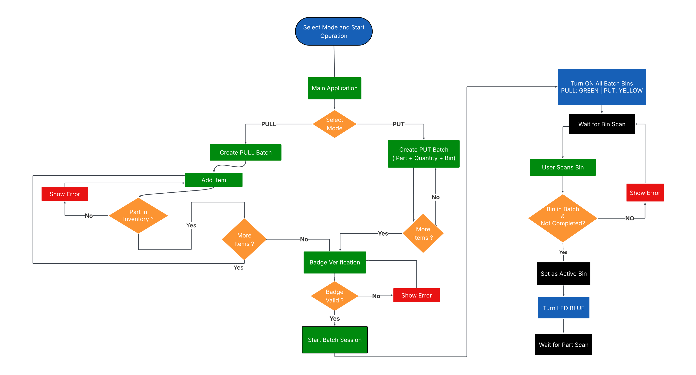

# Smart Storage Management System (SSMS) - Pick/Put-to-Light (PPTL) Warehouse Guidance System

This repository showcases the Smart Storage Management System (SSMS), a Pick/Put-to-Light (PPTL) warehouse guidance system developed as a Final Year Project (PFE) in Mechatronics.

## Overview

The SSMS is designed to streamline warehouse picking and put-away operations by guiding operators to the correct storage bins using visual indicators (addressable LEDs). It integrates hardware (ESP32, LED drivers, power management), firmware (MicroPython), and a desktop application (Python/Tkinter) with MQTT communication for real-time coordination.

## Problem Statement

Manual picking/put-away in warehouses is prone to errors and inefficiencies. The system aims to reduce search time, minimize picking errors, and improve operator guidance in small-to-medium storage setups.

## Objectives

- Design and implement a PPTL guidance system for warehouse bins
- Develop a user-friendly operator interface for order management
- Integrate embedded control with visual bin indicators
- Validate system functionality through testing

## Proposed Solution

The solution implements a Pick/Put-to-Light approach: when an operation (pick/put) is triggered, the relevant bin LEDs illuminate with appropriate color/indication to guide the operator. The system uses MQTT over local LAN to coordinate between the desktop GUI and the embedded controller.

## System Architecture

The system consists of:
- Embedded controller (ESP32-WROOM-32D) running MicroPython
- LED indicators (WS2813 addressable RGB LEDs) for bin guidance
- Level-shifting circuitry for reliable LED control
- Power management (HLK-PM01 AC/DC, 5V PSU)
- Desktop GUI (Python/Tkinter) for order/task management
- Local MQTT broker (Mosquitto) for inter-process communication.

## Methodology

The project followed the V-Cycle methodology: requirements analysis, functional design, detailed design, implementation, unit testing, integration testing, and validation.

## Results & Key Findings

The prototype successfully demonstrates guided picking/put-away operations with visual feedback. Key outcomes include reduced operator search time, improved clarity in task execution, and functional end-to-end integration between GUI, MQTT, and LED indicators.

## My Contribution

This PFE work was carried out as part of academic requirements. Contributions focused on system design, hardware integration, firmware development, GUI implementation, and validation/testing.

## Presentation

Slides: [Presentation Link](link)

## Full Report

The complete PFE report is included in this repository: [SSMS_Report.pdf](report/SSMS_Report.pdf)

## Media

Selected visuals are available in the [media/](media/) folder.

## Acknowledgments

Gratitude to project supervisors and institution for guidance and support throughout this work.

## Note

This repository is intended to showcase the project concept, documentation, report, and visuals. No source code is shared here.
